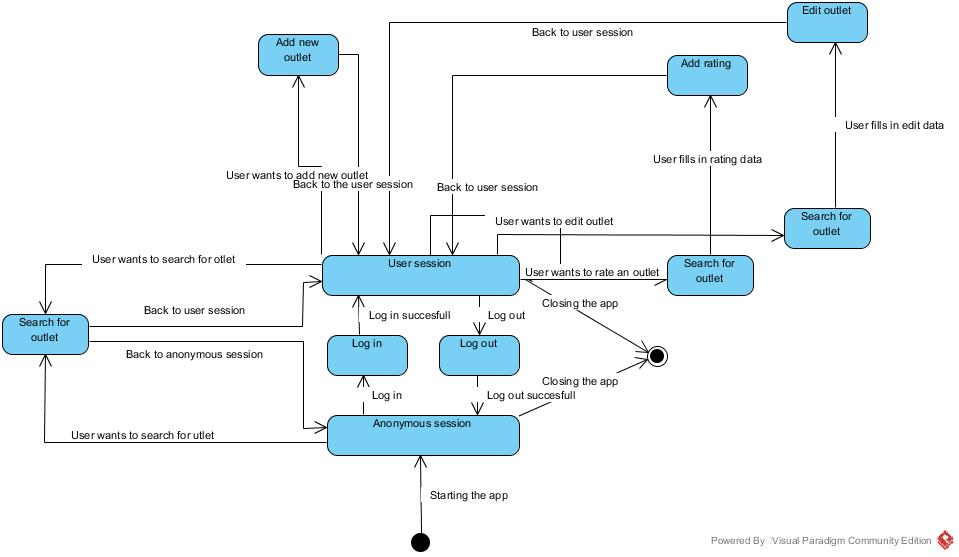

# Bazy Danych 2
## Projekt

## Hallowed Connection
_Aplikacja do wyszukiwania punktów z dostępem do energii elektrycznej_

Uczestnicy							| Prowadzący			| Termin zajęć			
------------------------------------|-----------------------|-----------------------
Szymon Abramski<br />Iwo Bujkiewicz	| Dr inż. Roman Ptak	| Poniedziałek 13:15

1. Wstęp

	1. Cel projektu
	1. Zakres projektu

1. Analiza wymagań

	1. Wymagania funkcjonalne
	1. Wymagania niefunkcjonalne

		1. Wykorzystywane technologie i narzędzia
		1. Wymagania dotyczące rozmiaru bazy danych
		1. Wymagania dotyczące bezpieczeństwa systemu

	1. Przyjęte założenia projektowe

1. Projekt systemu

	1. Projekt bazy danych

		1. Analiza rzeczywistości i uproszczony model konceptualny
		1. Model logiczny i normalizacja
		1. Model fizyczny i ograniczenia integralności danych
		1. Inne modele schematu - elementy przetwarzania danych

	1. Projekt aplikacji użytkownika

		1. Architektura aplikacji i diagramy projektowe
		1. Projekt wybranych funkcji systemu
		1. Projekt zabezpieczeń na poziomie aplikacji

1. Implementacja systemu bazy danych

	 1. Tworzenie tabel i definiowanie ograniczeń
	 1. Implementacja mechanizmów przetwarzania danych
	 1. Implementacja uprawnień i innych ograniczeń
	 1. Testowanie bazy danych na przykładowych danych.

1. Podsumowanie i wnioski
1. Literatura

<div class="page-break"></div>

### 1. Wstęp

#### 1.1. Cel projektu

Projektowane oprogramowanie ma na celu ułatwienie znajdywania gniazdek elektrycznych w różnego rodzaju ogólnodostępnych budynkach. Użytkownik powinien mieć możliwość odszukać swoją (lub dowolną inną) lokalizację na mapie, wybrać interesujący go budynek, następnie jego część (jeśli budynek jest na tyle duży aby go dzielić) i zobaczyć schematyczny plan danej części budynku z zaznaczonymi miejscami, w których rozmieszczone są gniazdka elektryczne.

Baza lokalizacji gniazdek wraz ze schematami powinna być powiększana przez użytkowników, bezpośrednio w tej samej aplikacji.

#### 1.2. Zakres projektu

Należało zaprojektować i zaimplementować bazę danych odpowiednią do przechowywania danych projektowanego oprogramowania, a także aplikację pozwalającą na dostęp do tych danych i ich modyfikację.

### 2. Analiza wymagań

#### 2.1. Wymagania funkcjonalne

* Użytkownik może zobaczyć mapę swojego otoczenia lub dowolnego miejsca na świecie, wraz z umieszczonymi na niej znacznikami miejsc z dostępem do gniazdek elektrycznych
* Użytkownik może wyszukać dowolne miejsce na świecie i zobaczyć, czy są tam opisane lokalizacje gniazdek
* Aplikacja umożliwia Użytkownikowi przegląd informacji na temat umieszczonego na mapie znacznika z lokalizacją gniazdek, tj. np. nazwy miejsca (jeśli adekwatne), krótkiego opisu, autorów (osób, które te informacje wprowadziły) oraz schematycznego szkicu rozmiesczenia gniazdek elektrycznych w opisywanym miejscu
* Użytkownik może dodawać nowe informacje o rozmieszczeniu gniazdek oraz edytować istniejące, bezpośrednio w aplikacji
* Aplikacja udostępnia proste narzędzia rysowania w celu zaznaczenia przybliżonych lokalizacji gniazdek eletkrycznych w budynkach i miejscach publicznych
* Użytkownik powinien mieć możliwość pozytywnej lub negatywnej oceny dodanego już znacznika z lokalizacją gniazdek oraz dodania komentarza opisującego ewentualne problemy
* Moderator ma dodatkowo możliwość edytowania informacji o lokalizacji gniazdek z pominięciem konieczności akceptacji
* Moderator może również arbitralnie akceptować lub odrzucać zmiany wprowadzane przez Użytkowników
* Administrator może dodatkowo zarządzać dostępem poszczególnych Użytkowników do systemu

#### 2.2 Wymagania niefunkcjonalne

* Aplikacja powinna pracować na mobilnym systemie operacyjnym (Android), z nowoczesnym graficznym interfejsem użytkownika
* Aplikacja powinna być rozbudowywalna; docelowo powinna mieć możliwość rozszerzenia o wersję webową

##### 2.2.1. Wykorzystywane technologie i narzędzia

Za system bazodanowy projektowanej usługi posłuży PostgreSQL, z którego instancją łączyć się będzie, za pośrednictwem JDBC, aplikacja serwerowa napisana w języku Java 9. Do dyspozycji użytkowników będzie aplikacja kliencka napisana w języku Java 8, projektowana na system operacyjny Android 7.1.2 i docelowo kompatybilna przynajmniej ze wszystkimi wersjami systemu Android od 5.0.1 wzwyż.

<div class="page-break"></div>

##### 2.2.2. Wymagania dotyczące rozmiaru bazy danych

Baza danych musi przechowywać dane geoprzestrzenne z dołączonymi
informacjami na temat lokalizacji gniazdek, konta użytkowników, poziomy uprawnień użytkowników, a także odniesienia przechowywanych danych geoprzestrzennych do informacji uzyskanych z API dostawcy map.

Biorąc pod uwagę ewentualne nieprzewidziane tutaj rodzaje przechowywanych informacji, ilość tabel w projekcie bazy danych szacowana jest na około 12. Baza danych powinna poradzić sobie z dziesiątkami lub nawet setkami tysięcy encji danych geoprzestrzennych oraz encji powiązań z API, dziesiątkami tysięcy encji kont użytkowników, a także milionami encji historii zmian.

##### 2.2.3. Wymagania dotyczące bezpieczeństwa systemu

Dane udostępniane przez aplikację powinny być zabezpieczone odpowiednio do swojej istotności w systemie. Dane dostępne dla każdego użytkownika, takie, jak na przykład miejsca z lokalizacją gniazdek, nie wymagają specjalnego traktowania, jednak dane przeznaczone tylko dla administratorów wymagają rygorystycznej kontroli dostępu. Niezależnie od dostępu użytkowników do danych, podczas komunikacji użytkownika (za pośrednictwem aplikacji klienckiej) z serwerem, żadne osoby postronne nie powinny mieć możliwości odczytania ani modyfikacji danych przesyłanych ani odbieranych przez użytkownika. Z tego powodu konieczna jest implementacja szyfrowania kanału wymiany informacji.

#### 2.3. Przyjęte założenia projektowe

Pojedyncze gniazdko powinno występować jako encja, w przypadku w którym użytkownik chce wyszukać gniazdko ze specyficznymi parametrami, takie jak napięcie czy też ilość złącz w jednym gniazdku. W celu uproszczenia obliczeń w aplikacji oraz zwiększenia czytelności prezentacji danych, encja ta nie będzie zawierała geolokacji, a tylko współrzędne na schemacie, o ile takowe istnieją.

### 3. Projekt systemu

#### 3.1. Projekt bazy danych

##### 3.1.1. Analiza rzeczywistości i uproszczony model konceptualny

Każdej lokalizacji na świecie można przypisać współrzędne geograficzne, nie inaczej jest z budynkami, dlatego też każdy budynek ma przypisane swoje współrzędne geograficzne, za pomocą których jest możliwe wyszukanie go. Niejednokrotnie zdarza się, iż budynek ma zbyt duży rozmiar, by pokazać go w całości. Z tej przyczyny postanowiono, by budynki były dzielone na części w celu ułatwienia ich przedstawiania użytkownikami. Wyjaśnia to istnienie encji "Buidling" oraz "Building Chunk", którym odpowiadają odpowiednio budynek oraz część budynku. Aplikacja z założenia ma być ulepszana przez użytkowników, więc dopuszczana jest możliwość pojawienia się fałszywych informacji, dlatego też powstały encje odpowiedzialne za przechowywanie wszelkich zmian, w przypadku gdyby wprowadzone zmiany miały na celu zakłócić funkcjonowanie aplikacji oraz głosowanie, przeprowadzane przez użytkowników w celu zweryfikowania proponowanej zmiany, co w założeniu ma obniżyć ilość pojawiających się nieprawdziwych danych.

<div class="page-break"></div>


_Model konceptualny_

##### 3.1.2. Model logiczny i normalizacja

Wszystkie powyższe problemy i anomalie, rozwiązują odpowiednie postacie normalne (postulaty Codd’a). Postacie normalne wyższego rzędu, implikują wszystkie niższe. Baza danych jest znormalizowana np. do trzeciej postaci normalnej, jeśli są spełnione 1NF – 3NF. Normalizacja to bezstratny proces organizowania danych w tabelach mający na celu zmniejszenie ilości danych składowanych w bazie oraz wyeliminowanie potencjalnych anomalii opisanych powyżej.

Pierwsza postać normalna to podstawa baz – mówi o atomowości danych. Czyli tabela (encja) przechowuje dane w sposób atomowy. Każde pole przechowuje jedną informację, dzięki czemu możemy dokonywać efektywnych zapytań. Wprowadza także pojęcie istnienie klucza głównego identyfikującego bezpośrednio każdy wiersz –unikalności. Warto pamiętać również o tym, że w dziedzinie teorii zbiorów kolejność wierszy jest dowolna (chyba że jawnie taki zbiór posortujemy).

Druga postać normalna określa esencję dobrego projektowania bazy. Mówi o tym, że każda tabela powinna przechowywać dane dotyczące tylko konkretnej klasy obiektów. Jeśli mówimy o encji (tabeli) np. Klienci, to wszystkie kolumny opisujące elementy takiej encji, powinny dotyczyć Klientów a nie jakiś innych obiektów (np. ich zamówień).

Trzecia postać normalna głosi, że kolumna informacyjna nie należąca do klucza nie zależy też od innej kolumny informacyjnej, nie należącej do klucza. Czyli każdy niekluczowy argument jest bezpośrednio zależny tylko od klucza głównego a nie od innej kolumny. Baza danych stworzona w projekcie spełnia wszystkie wymienione powyżej wymagania, jest więc w trzeciej postaci normalnej.

<div class="page-break"></div>


_Model logiczny_

##### 3.1.3. Model fizyczny i ograniczenia integralności danych

W zaprojektowanej bazie danych zastosowano następujące wytyczne dotyczące integralności struktur bazodanowych:

Integralność semantyczna jeżeli wartości danych spełniają wcześniej zdefiniowane i nałożone ograniczenia (dopuszczalny typ, zakres długości, format), wówczas mówimy, że zachowana jest integralność semantyczna relacyjnej bazy danych. W ujęciu formalnym integralność semantyczna jest zachowana, jeżeli dane należą do zdefiniowanej wcześniej dziedziny.

Integralność encji jest zachowana, jeśli każda tabela posiada klucz główny, a jego wartości w ramach tabeli są unikatowe i różne od wartości NULL (co zapewnia, że krotki w tabeli nie będą się powtarzać).

Integralność referencyjna jest zachowana, jeśli każda wartość klucza obcego jest równa jakiejś wartości klucza głównego w powiązanej tabeli nad rzędnej lub ewentualnie jest równa NULL.

<div class="page-break"></div>


_Model fizyczny_

##### 3.1.4. Inne modele schematu - elementy przetwarzania danych

W bazie danych został zaimplementowany widok, pozwalający na wyświetlenie wszystkich gniazdek elektrycznych, wraz z odopowiadającymi im kawałkami budynków w kótrym się znajdują, oraz całych budynków, w których owe części się znajdują. Widok ten zatem pozwala na wyświetlenie wszystkich danych, na których opiera się działanie aplikacji.

Ponadto, w systemie zostały zaimplementowane triggery, które są wywoływane przy modyfikacji gniazdka. W przypadu gdy gniazdko, budynek, lub kawałek budynku jest modyfikowane, są za to odpowiedzialne odpowiadające im encje, w tym przypadku "Building Modification", "Building Chunk Modification" oraz Outlet Point Modification", które przechowują wszystkie nowowprowadzone dane, jak również wszystkie poprzednie wartości encji "Building", "BuildingChunk" oraz "OutletPoint". Zadaniem tiggera jest aktualizowanie tychże encji na podstawie wprowadzonych modyfikacji i jest on wyzwalany, gdy propozycja zmiany zostanie zaakceptowana przez użytkowników.

#### 3.2. Projekt aplikacji użytkownika

##### 3.2.1. Architektura aplikacji i diagramy projektowe

Aplikacja z założenia jest tylko niewielką częścią całego projektu, dlatego postanowiono ją uprościć, jednak z zapewnieniem pełnej jej funkcjonalności.

W zależności od poziomu uprawnień użytkownika ilość dostępnych funkcji różni się. Z poziomu sesji anonimowej, użytkownik ma prawo jedynie do przeglądania gniazdek. W sesji użytkownika, jest możliwe dodatkowo ocenianie przeglądanych gniazdek, dodawanie nowych, a także edytowanie już wprowadzonych i głosowanie nad wprowadzeniem zmian. Każdej operacji związanej z punktami dostępowymi towarzyszy łączenie aplikacji do api Google Maps, w celu wyświetlenie żądanej przez użytkownika lokalizacji, na podstawie danych geoprzestrzennych. Dodawaniu nowego gniazdka towarzyszy wywołanie zaimplementowanego narzędzia do rysowania prostych schematów, w celu określenia przybliżonej lokalizacji gniazdka.


_Diagram przypadków użycia reprezentujący działanie aplikacji_


_Diagram stanów reprezentujący działanie aplikacji_

<br /><br /><br /><br /><br /><br />

##### 3.2.2. Projekt wybranych funkcji systemu


_Diagram czynności przedstawiający wyszukiwanie gniazdka_


_Diagram czynności przedstawiający wyświetlanie informacji o gniazdku_


_Diagram czynności przedstawiający dodawanie nowego gniazdka_


_Diagram czynności przedstawiający edytowanie istniejącego gniazdka_

<br /><br /><br /><br />

##### 3.2.3. Projekt zabezpieczeń na poziomie aplikacji

W celu zabezpieczenia poufności danych wszystkie hasła dostępu są haszowane, by zminimalizować ryzyko wycieku kluczowych danych w czasie ich przesyłania.

Zabezpieczeniem przed utratą danych są wprowadzone poziomy dostępu, które mogą nadawać administratorzy, w tym przypadku deweloperzy, w razie próby dodania nieprawdziwych informacji, konto danego użytkownika może zostać zablokowane. Z racji tego, że system będzie uzupełniany przez użytkowników, wszystkie próby zmian będą podlegały głosowaniu społecznościowemu, by wykluczyć możliwość zmiany danych przez pojedynczą jednostkę. Ponadto, wprowadzono system oceniania i komentowania, by wprowadzone nieprawidłowo nowe gniazdka mogły zostać wychwycone i w zależności od sytuacji, edytowane lub usunięte.

<div class="page-break"></div>

### 4. Implementacja systemu bazy danych

#### 4.1. Tworzenie tabel i definiowanie ograniczeń

Według przedstawionego wcześniej modelu fizycznego utworzono tabele bazy danych w systemie PostgreSQL. Poniżej przedstawiono przykładowe polecenie SQL, tworzące tabelę `Building`.

```SQL
CREATE TABLE building (
    id bigint NOT NULL,
    lat double precision NOT NULL,
    lon double precision NOT NULL,
    name character varying(420) NOT NULL,
    description character varying(840) NOT NULL,
    submitted_by bigint,
    time_submitted timestamp without time zone NOT NULL,
    flags bigint NOT NULL,
    outlet_count integer NOT NULL,
    CONSTRAINT latlon_within_range CHECK (((lat >= ('-90'::integer)::double precision) AND (lat <= (90)::double precision) AND (lon >= ('-180'::integer)::double precision) AND (lon <= (180)::double precision))),
    CONSTRAINT outlet_count_not_negative CHECK ((outlet_count >= 0))
);
```

Do każdej tabeli dodawany był klucz główny oraz potrzebne indeksy.

```SQL
ALTER TABLE ONLY building
    ADD CONSTRAINT building_pkey PRIMARY KEY (id);
	
CREATE INDEX building_latlon_index ON building USING btree (lat, lon);

CREATE INDEX building_submitter_index ON building USING btree (submitted_by);
```

W każdej tabeli, każda kolumna, która zawierała odniesienia do encji z innej tabeli, otrzymywała ograniczenie klucza obcego, które dodatkowo usuwało encję z bieżącej tabeli bądź ustawiało wartość w danej kolumnie na NULL w przypadku usunięcia encji, do której bieżąca encja się odnosiła.

```SQL
ALTER TABLE ONLY building
    ADD CONSTRAINT building_submitted_by_fkey FOREIGN KEY (submitted_by) REFERENCES "user"(id) ON DELETE SET NULL;
```

<div class="page-break"></div>

#### 4.2. Implementacja mechanizmów przetwarzania danych

W celu uproszczenia zarządzania historią zmian danych przechowywanych w bazie, zaimplementowano triggery, korzystające z procedur składowanych, które automatycznie aktualizowały encje z bieżącymi danymi na podstawie nowych zmian.

```SQL
CREATE FUNCTION buildingmodification_update() RETURNS trigger
    LANGUAGE plpgsql
    AS $$
BEGIN
 IF (TG_OP = 'INSERT' OR OLD.approved IS FALSE) AND NEW.approved IS TRUE THEN
  IF NEW.building_id IS NULL THEN
   IF NEW.lat_before IS NULL AND NEW.lon_before IS NULL AND NEW.name_before IS NULL AND NEW.description_before IS NULL AND NEW.flags_before IS NULL AND NEW.lat_after IS NOT NULL AND NEW.lon_after IS NOT NULL AND NEW.name_after IS NOT NULL AND NEW.description_after IS NOT NULL AND NEW.flags_after IS NOT NULL THEN
    DECLARE
    insertion_id int8;
    BEGIN
     insertion_id := (random() - 0.5) * 2.0 * 9223372036854775807;
     PERFORM * FROM building WHERE building.id = insertion_id;
     WHILE FOUND LOOP
      insertion_id := (random() - 0.5) * 2.0 * 9223372036854775807;
      PERFORM * FROM building WHERE building.id = insertion_id;
     END LOOP;
     INSERT INTO building VALUES (insertion_id, NEW.lat_after, NEW.lon_after, NEW.name_after, NEW.description_after, NEW.submitted_by, NEW.time_submitted, NEW.flags_after, 0);
     UPDATE buildingmodification SET building_id = insertion_id WHERE id = NEW.id;
    END;
   ELSE
    RAISE EXCEPTION 'When building_id is null, BuildingModification can only be an insertion';
   END IF;
  ELSE
   IF NEW.lat_before IS NOT NULL AND NEW.lon_before IS NOT NULL AND NEW.name_before IS NOT NULL AND NEW.description_before IS NOT NULL AND NEW.flags_before IS NOT NULL THEN
    PERFORM * FROM building WHERE building.id = NEW.building_id;
    IF FOUND THEN
     IF NEW.lat_after IS NOT NULL AND NEW.lon_after IS NOT NULL AND NEW.name_after IS NOT NULL AND NEW.description_after IS NOT NULL AND NEW.flags_after IS NOT NULL THEN
      UPDATE building SET building.lat = NEW.lat_after, building.lon = NEW.lon_after, building.name = NEW.name_after, building.description = NEW.description_after, building.flags = NEW.flags_after WHERE building.id = NEW.building_id;
     ELSEIF NEW.lat_after IS NULL AND NEW.lon_after IS NULL AND NEW.name_after IS NULL AND NEW.description_after IS NULL AND NEW.flags_after IS NULL THEN
      DELETE FROM building WHERE building.id = NEW.building_id;
     ELSE
      RAISE EXCEPTION 'Invalid BuildingModification';
     END IF;
    ELSE
     RAISE EXCEPTION 'Building with id % not found', NEW.building_id;
    END IF;
   ELSE
    RAISE EXCEPTION 'Invalid BuildingModification';
   END IF;
  END IF;
 END IF;
 RETURN NEW;
END;
$$;

CREATE TRIGGER buildingmodification_update AFTER INSERT OR UPDATE ON buildingmodification FOR EACH ROW EXECUTE PROCEDURE buildingmodification_update();
```

<div class="page-break"></div>

#### 4.3. Implementacja uprawnień i innych ograniczeń

Na poziomie bazy danych uprawnienia zaimplementowano w ramach wbudowanego w PostgreSQL systemu kontroli dostępu. Do zarządzania bazą danych projektu przeznaczona została rola `hallowed`, będąca właścicielem bazy `hallowed` i całej jej zawartości. Dla serwera aplikacji utworzona została rola `hallowedserver`. Każdy administrator danych otrzymuje członkostwo w roli `datamaster`, a ponadto administratorzy systemu mogą korzystać z roli `sudoer`, umożliwiającej tymczasowe przełączenie uprawnień na tryb quasi-superusera (`su`) w celu wykonania zaawansowanych czynności konserwacyjnych.

Rola			| Atrybuty														| Należy do				
----------------|---------------------------------------------------------------|-----------------------
datamaster		| Create role, Create DB, Cannot login							| {hallowed}
hallowed		| Cannot login													| {}
hallowedserver	| 																| {hallowed}
outfrost		| 																| {datamaster,sudoer}
postgres		| Superuser, Create role, Create DB, Replication, Bypass RLS	| {}
su				| Superuser, Create role, Create DB, Cannot login				| {}
sudoer			| No inheritance, Cannot login									| {su}

#### 4.4. Testowanie bazy danych na przykładowych danych.

Bazę danych testowano za pomocą testów jednostkowych JUnit. Przykładowy test zamieszczono poniżej.

```Java
@Test
void getBuilding() throws SQLException, ClassNotFoundException {
	Building building = outletInfoManager.getBuilding(720195837538547236L);
	
	assertNotNull(building);
	assertEquals("Pasaż Grunwaldzki", building.getName());
	assertEquals(51.4232, building.getLat());
	assertEquals(17.1992, building.getLon());
}
```

### 5. Podsumowanie i wnioski

Zaprojektowany system jest w pełni użytkowalny i działa z myślą o rozwiązaniu problemów z rozładowaną baterią urządzeń mobilnych. System ma być z założenia głównie rozwijany przez jego użytkowników, a jego szybkość rozwoju systemu jest proporcjonalna do ilości użytkowników. Docelowo aplikacja ma być rozwijana i poprawiana przez deweloperów, jest w planach stworzenie aplikacji desktopowej, jako alternatywy dla dostępnej aktualne wersji mobilnej.

Najważniejsze w fazie projektowania jest wybór odpowiednich narzędzi do stworzenia systemu, należy przewidzieć obciążenie bazy danych, czyli ilość zapytań w ciągu dnia. Programowanie na podstawie narysowanych wcześniej diagramów i modeli pozwala uniknąć pomyłek i konieczności większych zmian.

### 6. Literatura

1. Ben-Gan, I., 2016. _T-SQL Fundamentals Third Edition_ (MSPress, 2016)

1. Various, 2008-2017. _Stack Overflow_ (https://stackoverflow.com)
